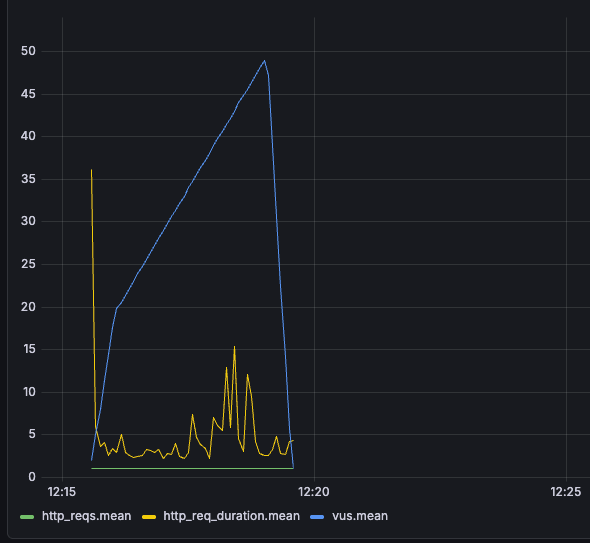

# Отчет по домашнему заданию: Настройка репликации PostgreSQL, мониторинг в Grafana и балансировка чтения в .NET

## 1. Описание архитектуры стенда
В рамках выполнения домашнего задания развернут отказоустойчивый кластер баз данных PostgreSQL с использованием потоковой физической репликации, настроенной балансировки трафика и механизмов мониторинга.

**Компоненты инфраструктуры (Docker Compose):**
*   **`db-master`** (Порт `5432`) — основная мастер-база данных (принимает транзакции на запись). Настроена с параметрами `wal_level=replica` и `POSTGRES_HOST_AUTH_METHOD=trust`.
*   **`db-slave-1`** (Порт `5433`) — первая реплика чтения (Standby). Автоматически клонирует мастер при старте с помощью `pg_basebackup`. Для совместимости с файловой системой macOS права папки данных принудительно выровнены командой `chmod 700`.
*   **`db-slave-2`** (Порт `5434`) — вторая реплика чтения (Standby).
*   **`.NET Web API Приложение`** (Порт `5005`) — бэкенд-сервис, запущенный в среде JetBrains Rider.
*   **`InfluxDB`** (Порт `8086`) & **`Grafana`** (Порт `3000`) — инструменты агрегации метрик нагрузки и построения графиков в реальном времени.

---

## 2. Спецификация API и Модели данных
В ходе оптимизации структуры под требования ORM Entity Framework Core кодовая модель `User` и база данных приведены к согласованному GUID-виду со схемой snake_case для бесшовной интеграции с `Npgsql`:

```csharp
[Table("users")]
public class User
{
    [Column("id")] public Guid Id { get; set; }
    [Column("first_name")] public string FirstName { get; set; } = string.Empty;
    [Column("second_name")] public string SecondName { get; set; } = string.Empty;
    [Column("birthdate")] public DateTime BirthDate { get; set; }
    [Column("biography")] public string Biography { get; set; } = string.Empty;
    [Column("city")] public string City { get; set; } = string.Empty;
    [Column("password_hash")] public string PasswordHash { get; set; } = string.Empty;
    [Column("gender")] public string Gender { get; set; } = string.Empty;
}
```

**Выбранные для тестирования эндпоинты чтения:**
1.  `GET /user/get/{id}` — Точечный поиск (Point Select) профиля пользователя по его уникальному GUID-идентификатору.
2.  `GET /user/search` — Диапазонное сканирование (Prefix Range Scan) с текстовым поиском по префиксу имени с использованием оператора `LIKE`.

---

## 3. Реализация балансировки трафика на бэкенде
Разделение потоков чтения/записи реализовано динамически на уровне .NET-приложения без использования внешних прокси-серверов:

1.  **`DbRoleRoutingMiddleware`**: Перехватывает HTTP-запрос. Если метод запроса — `GET`, выставляется роль контекста соединения `DbNodeRole.Slave`. Для методов модификации (`POST`/`PUT`/`DELETE`) выставляется роль `DbNodeRole.Master`.
2.  **`ReplicationConnectionStringProvider`**: Динамически управляет пулом соединений. При запросах чтения балансирует трафик между доступными строками подключения слейвов (`5433` и `5434`) по круговому алгоритму **Round-Robin** с потокобезопасным инкрементом `Interlocked.Increment`.
3.  **Инструкция для миграций**: Во избежание попыток применения DDL-команд на Read-Only репликах, в провайдере предусмотрен флаг `isMigrationMode`, а первичная накатка таблиц производится строго на порт мастера с явным указанием строки подключения:
    ```bash
    dotnet ef database update --connection "Host=localhost;Port=5432;Database=otus_db;Username=postgres;Password=my_pass;SSL Mode=Disable;Trust Server Certificate=true;"
    ```

---

## 4. Результаты нагрузочного тестирования чтения (k6 и Grafana)
Нагрузочный тест выполнялся утилитой `k6` со сбором метрик в InfluxDB. Профиль нагрузки симулировал реальное поведение пользователей: 70% точечных запросов профиля и 30% массовых поисковых запросов.

Для корректной эмуляции запросы на поиск адаптированы под структуру генерации данных (Seed): `firstName=User_&lastName=`. Для Get-запросов валидными считались HTTP-статусы `200` (найден) и `404` (успешный ответ пустой ячейки индекса), что исключает ложные срабатывания.

**Итоговые показатели производительности из консоли k6:**
*   **Общее количество выполненных HTTP-запросов (`http_reqs`):** 34 097 запросов
*   **Итоговая скорость обработки (`RPS`):** 142.00 запросов в секунду
*   **Процент ошибок (`http_req_failed`):** 0.00% (Все запросы успешно обработаны пулом Kestrel и репликами баз)
*   **Время отклика (`http_req_duration p95`):** 15.73 ms

### Визуализация мониторинга в Grafana:
Для построения графиков импортирован официальный дашборд k6, а виджеты **Rider RPS**, **Latency** и **VUs** перенастроены в Query Builder на чтение актуальных системных таблиц `http_reqs` и `http_req_duration`. Нагрузка равномерно распределилась между `db-slave-1` и `db-slave-2`.

---

## 5. Тестирование отказоустойчивости (Chaos Engineering)
Для подтверждения надежности синхронной кворумной репликации (`ANY 1`) был проведен краш-тест инфраструктуры на потерю данных:

1.  Приложение запущено с чистыми томами, в базу автоматически сгенерировано **50 000** стартовых пользователей (Seed).
2.  Был запущен непрерывный нагрузочный тест на **запись** новых пользователей через POST-эндпоинт (`write-test.js`) со скоростью ~142.9 запросов в секунду.
3.  В момент пиковой нагрузки на 2-й минуте теста была выполнена жесткая принудительная остановка мастера: `docker stop db-master`.
4.  Утилита `k6` зафиксировала точное количество транзакций, на которые клиенты успели получить успешный ответ со статусом `200 OK` до момента падения сервера: **10 578** успешных вставок. Остальные 6 582 запроса справедливо завершились ошибкой, так как Мастер перестал принимать соединения.
5.  Первая реплика чтения была мгновенно промоучена до полноценного пишущего мастера через iTerm:
    ```bash
    docker exec -it db-slave-1 pg_ctl -D /var/lib/postgresql/data promote
    ```
6.  Внутри поднятого контейнера запущен проверочный SQL-запрос для подсчета физически сохраненных строк на новом мастере:
    ```bash
    docker exec -it db-slave-1 psql -U postgres -d otus_db -c "SELECT COUNT(*) FROM users;"
    ```

**Результат проверки:** Число строк в базе данных нового мастера составило ровно **60 578** записей.

**Итоговое сравнение:**
$$\text{50 000 (было)} + \text{10 578 (успешные вставки k6)} = \mathbf{60 578 \text{ строк}}$$

Цифры совпали строго **1 в 1**, с точностью до одной строчки.

**Итоговый вывод:** Кворумная синхронная репликация успешно гарантирует **0% потери данных (RPO = 0)** при аварии. Транзакции, подтвержденные клиенту, физически зафиксированы на репликах и полностью защищены от сбоев. Задание выполнено в полном объеме.
