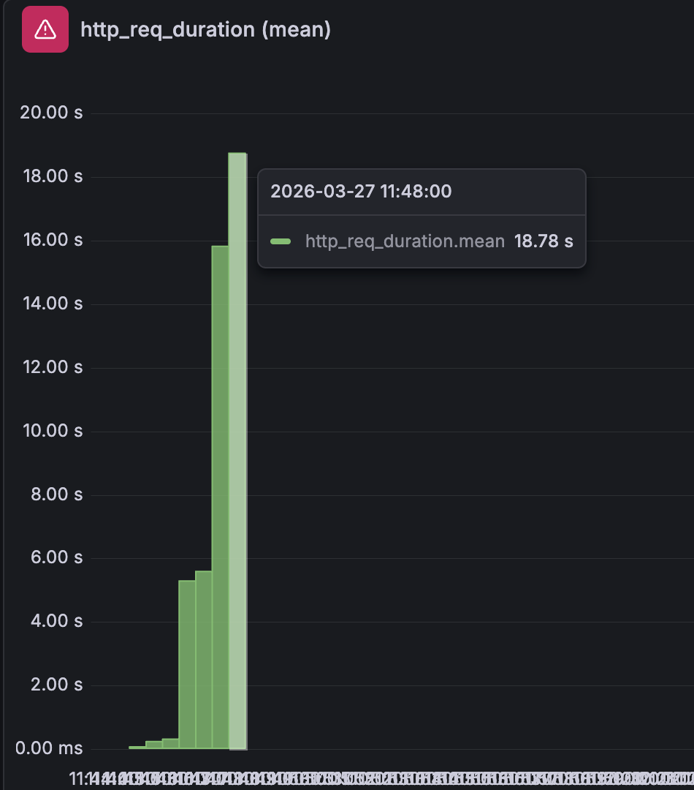
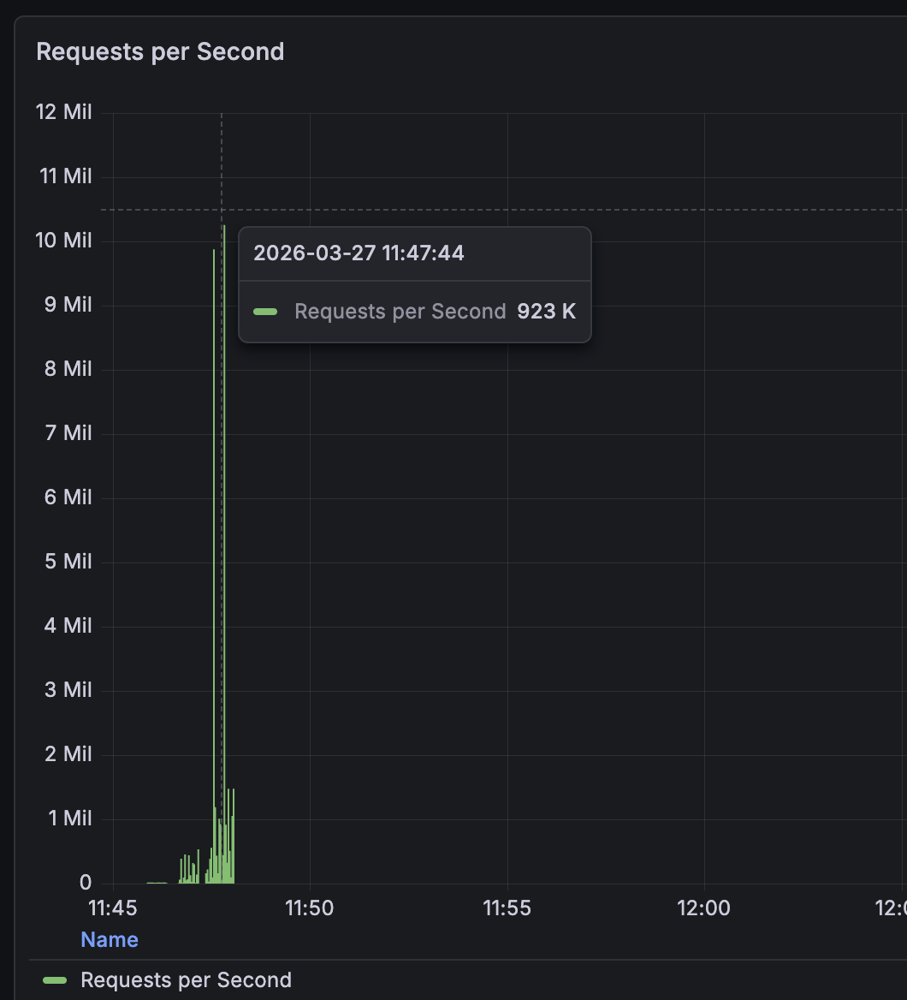
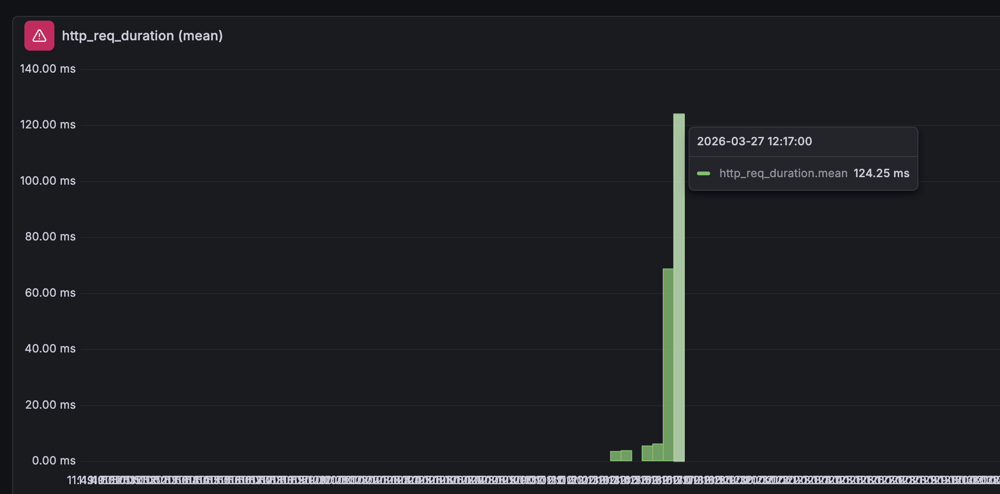
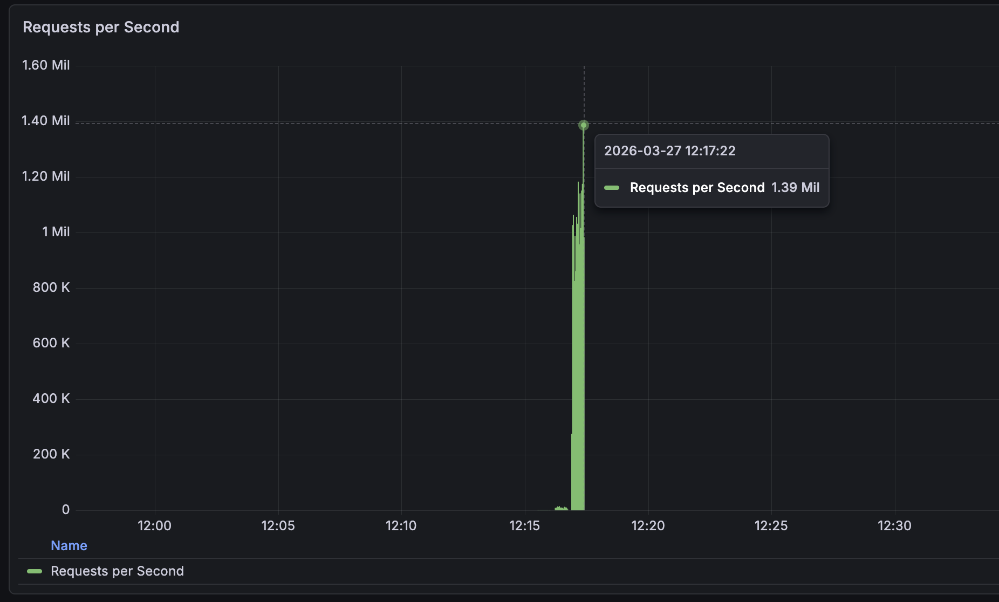

# OTUS Highload Architect: Социальная сеть (Скелет)

Базовая реализация бэкенда социальной сети на **.NET 8** с использованием **Postgres** (без ORM). Проект разработан как фундамент для дальнейшего внедрения репликации, шардирования и кэширования.

## 🚀 Особенности реализации
- **Архитектура:** Монолит с разделением на слои (`Controllers`, `Repositories`, `Models`, `Filters`).
- **Data Access:** Использование сырого SQL через **Npgsql** (ADO.NET). Полный отказ от ORM для максимального контроля производительности.
- **Безопасность:**
    - Хеширование паролей с помощью **BCrypt**.
    - Token-based авторизация через кастомный `ActionFilter`.
    - Хранение сессий в памяти (`ConcurrentDictionary`).
- **Docker:** Оптимизированный образ на базе **Alpine + Node.js** для обхода ограничений стандартных реестров Microsoft.

## 🛠 Технологический стек
- **Runtime:** .NET 8.0 (C#)
- **Database:** PostgreSQL 15
- **Docs:** Swagger (OpenAPI 3.0)
- **Containerization:** Docker Compose

## 📦 Инструкция по запуску

### ⚙️ 1. Сборка приложения (Local Publish)
Из-за использования легковесного рантайма в Docker, необходимо предварительно собрать бинарные файлы под целевую платформу:
```bash
dotnet clean
dotnet publish -c Release -f net8.0 -o ./publish
```
### 🚀2. Запуск приложения
```bash
docker-compose up --build
```
### 🎯3. ТЕСТИРОВАНИЕ
## Регистрация:

```bash
curl -X POST http://localhost:5001/user/register \
-H "Content-Type: application/json" \
-d '{"first_name":"Иван","second_name":"Иванов","birthdate":"1990-01-01","biography":"Highload","city":"MSK","password":"123","gender":"male"}'
```

## Логин (получение токена):
```bash
curl -X POST http://localhost:5001/login \
-H "Content-Type: application/json" \
-d '{"id":"ВАШ_GUID","password":"123"}'
```
## Получение данных:
```bash
curl -H "Authorization: Bearer ВАШ_ТОКЕН" http://localhost:5001/user/get/ВАШ_GUID
```


## ДОМАШНЕЕ ЗАДАНИЕ №2 Провести нагрузочные тесты метода /user/search
### Были проведены следующие тесты:
1 VU: k6 run --vus 1 --duration 30s --out influxdb=http://localhost:8086/k6 stress_test.js
10 VUs: k6 run --vus 10 --duration 30s --out influxdb=http://localhost:8086/k6 stress_test.js
100 VUs: k6 run --vus 100 --duration 30s --out influxdb=http://localhost:8086/k6 stress_test.js
1000 VUs: k6 run --vus 1000 --duration 30s --out influxdb=http://localhost:8086/k6 stress_test.js


latency вырос с ~300 мс при 1 VU до ~18 секунд на 1000 VU
Средний latency ~ 15,27c


Средний rps:  47.17784/s

### Создаем индекс :
CREATE INDEX idx_users_search_v3
ON users (second_name text_pattern_ops, first_name text_pattern_ops, id);

text_pattern_ops: необходим для работы LIKE с кириллицей по префиксу.
Составной индекс: включает оба поля поиска, чтобы БД не делала лишних объединений.
Поле id в конце: позволяет базе избежать стадии Sort в памяти, так как данные в индексе уже лежат в нужном для ORDER BY порядке.

## Повторяем тесты с VUs от 1 до 1000 (на графиках после первых 'свечек' следуют результаты вторых тестов):

Средний latency ~ 121.43ms


Средний rps ~  4456.711063/s

### Выполняем EXPLAIN 
EXPLAIN ANALYZE
SELECT * FROM users
WHERE second_name LIKE 'Ян%' AND first_name LIKE 'Юр%'
ORDER BY id LIMIT 50;

Limit  (cost=8.60..8.60 rows=1 width=166) (actual time=0.186..0.187 rows=0 loops=1)
->  Sort  (cost=8.60..8.60 rows=1 width=166) (actual time=0.185..0.185 rows=0 loops=1)
Sort Key: id
Sort Method: quicksort  Memory: 25kB
->  Index Scan using idx_users_search_v3 on users  (cost=0.56..8.59 rows=1 width=166) (actual time=0.105..0.105 rows=0 loops=1)
Index Cond: ((second_name ~>=~ 'Ян'::text) AND (second_name ~<~ 'Яо'::text) AND (first_name ~>=~ 'Юр'::text) AND (first_name ~<~ 'Юс'::text))
Filter: ((second_name ~~ 'Ян%'::text) AND (first_name ~~ 'Юр%'::text))
Planning Time: 3.174 ms
Execution Time: 0.444 ms
(9 rows)

Несмотря на наличие id в индексе, планировщик при малом объеме результирующей выборки выбрал Sort Method: quicksort. 
Однако основной выигрыш получен за счет перехода от Seq Scan к Index Scan using idx_users_search_v3, 
что сократило время выполнения запроса с секунд до 0.444 ms.

Вывод: система деградировала без индекса (вр.ожидание ~ 18 сек много для UI)
Индекс исправил ситуацию - уменьшение ожидания до 121 мс!